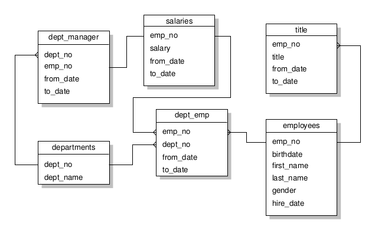
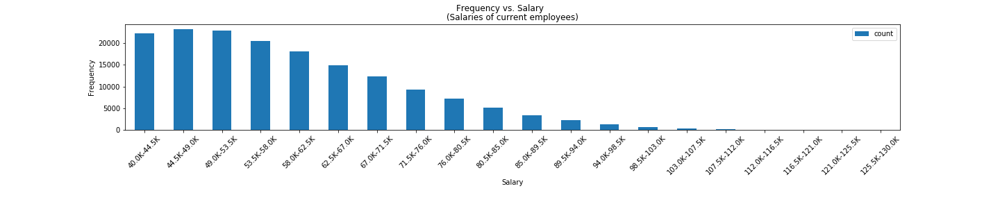
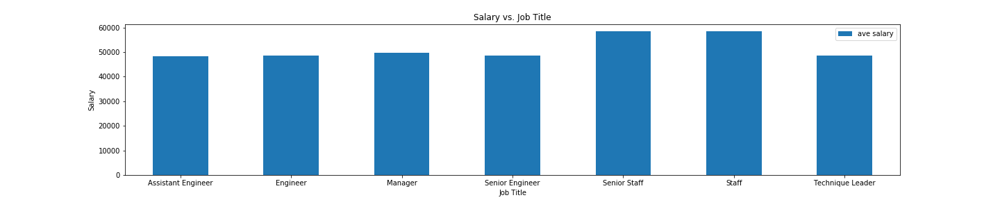

# SQL challenge

## Description

The SQL file `schema.sql` creates a schema of tables on information related to employees at a fictional company (See ERD below).  The other SQL file, `queries.sql`, runs several queries on the imported data tables.  Also included is a jupyter lab notebook, `fake_or_real.ipynb`, for generating a few plots from the data to see if it seems reasonable.  These may be found in the Plots section below.

### Plots

### Some query results.

1. List the following details of each employee: employee number, last name, first name, gender, and salary.

~~~
SELECT e.emp_no, e.last_name, e.first_name, e.gender, s.salary
FROM employees AS e
INNER JOIN salaries AS s
ON e.emp_no = s.emp_no LIMIT 10;
~~~

| emp_no |  last_name  |  first_name | gender |  salary  |
|:------:|:-----------:|:-----------:|--------|:--------:|
|  10001 |  "Facello"  |   "Georgi"  | "M"    | 60117.00 |
| 10002  | "Simmel"    | "Bezalel"   | "F"    | 65828.00 |
| 10003  | "Bamford"   | "Parto"     | "M"    | 40006.00 |
| 10004  | "Koblick"   | "Chirstian" | "M"    | 40054.00 |
| 10005  | "Maliniak"  | "Kyoichi"   | "M"    | 78228.00 |
| 10006  | "Preusig"   | "Anneke"    | "F"    | 40000.00 |
| 10007  | "Zielinski" | "Tzvetan"   | "F"    | 56724.00 |
| 10008  | "Kalloufi"  | "Saniya"    | "M"    | 46671.00 |
| 10009  | "Peac"      | "Sumant"    | "F"    | 60929.00 |
| 10010  | "Piveteau"  | "Duangkaew" | "F"    | 72488.00 |

<!--
emp_no  last_name   first_name  gender  salary
10001	"Facello"	"Georgi"	"M"	60117.00
10002	"Simmel"	"Bezalel"	"F"	65828.00
10003	"Bamford"	"Parto"	"M"	40006.00
10004	"Koblick"	"Chirstian"	"M"	40054.00
10005	"Maliniak"	"Kyoichi"	"M"	78228.00
10006	"Preusig"	"Anneke"	"F"	40000.00
10007	"Zielinski"	"Tzvetan"	"F"	56724.00
10008	"Kalloufi"	"Saniya"	"M"	46671.00
10009	"Peac"	"Sumant"	"F"	60929.00
10010	"Piveteau"	"Duangkaew"	"F"	72488.00
-->

2. List employees who were hired in 1986.
~~~
SELECT first_name, last_name, birthdate
	FROM employees 
	WHERE (hire_date < '1987-01-01' 
	AND (hire_date >= '1986-01-01')) LIMIT 10;
~~~

| first_name  | last_name      | birthdate    |
|-------------|----------------|--------------|
|   "Georgi"  |    "Facello"   | "1953-09-02" |
|   "Parto"   |    "Bamford"   | "1959-12-03" |
| "Chirstian" | "Koblick"      | "1954-05-01" |
| "Sanjiv"    | "Zschoche"     | "1954-09-13" |
| "Kwee"      | "Schusler"     | "1952-11-13" |
| "Kshitij"   | "Gils"         | "1961-10-05" |
| "Zhongwei"  | "Rosen"        | "1960-12-17" |
| "Xinglin"   | "Eugenio"      | "1959-07-23" |
| "Sudharsan" | "Flasterstein" | "1963-03-21" |
| "Kendra"    | "Hofting"      | "1961-05-30" |

3. List the manager of each department with the following information: department number, department name, the manager's employee number, last name, first name, and start and end employment dates.
~~~
SELECT dm.dept_no, d.dept_name, e.emp_no, e.last_name, e.first_name, dm.from_date, dm.to_date
FROM employees AS e 
INNER JOIN dept_manager AS dm ON e.emp_no=dm.emp_no
INNER JOIN departments AS d ON dm.dept_no=d.dept_no LIMIT 10;
~~~
| dept_no | dept_name         | emp+no | last_name      | first_name  | from_date    | to_date      |
|---------|-------------------|--------|----------------|-------------|--------------|--------------|
| "d001"  | "Marketing"       | 110022 | "Markovitch"   | "Margareta" | "1985-01-01" | "1991-10-01" |
|  "d001" |    "Marketing"    | 110039 | "Minakawa"     | "Vishwani"  | "1991-10-01" | "9999-01-01" |
|  "d002" |     "Finance"     | 110085 | "Alpin"        | "Ebru"      | "1985-01-01" | "1989-12-17" |
| "d002"  | "Finance"         | 110114 | "Legleitner"   | "Isamu"     | "1989-12-17" | "9999-01-01" |
| "d003"  | "Human Resources" | 110183 | "Ossenbruggen" | "Shirish"   | "1985-01-01" | "1992-03-21" |
| "d003"  | "Human Resources" | 110228 | "Sigstam"      | "Karsten"   | "1992-03-21" | "9999-01-01" |
| "d004"  | "Production"      | 110303 | "Wegerle"      | "Krassimir" | "1985-01-01" | "1988-09-09" |
| "d004"  | "Production"      | 110344 | "Cools"        | "Rosine"    | "1988-09-09" | "1992-08-02" |
| "d004"  | "Production"      | 110386 | "Kieras"       | "Shem"      | "1992-08-02" | "1996-08-30" |
| "d004"  | "Production"      | 110420 | "Ghazalie"     | "Oscar"     | "1996-08-30" | "9999-01-01" |

4. List the department of each employee with the following information: employee number, last name, first name, and department name.
~~~
SELECT e.emp_no, e.last_name, e.first_name, d.dept_name
FROM employees AS e 
LEFT JOIN dept_emp AS de
ON e.emp_no=de.emp_no
INNER JOIN departments AS d
ON d.dept_no=de.dept_no
WHERE de.to_date='9999-01-01' LIMIT 10;
~~~

| emp_no | last_name   | first_name  | dept_name            |
|--------|-------------|-------------|----------------------|
| 10001  | "Facello"   | "Georgi"    | "Development"        |
| 10002  | "Simmel"    | "Bezalel"   | "Sales"              |
|  10003 |  "Bamford"  |   "Parto"   | "Production"         |
|  10004 |  "Koblick"  | "Chirstian" | "Production"         |
| 10005  | "Maliniak"  | "Kyoichi"   | "Human Resources"    |
| 10006  | "Preusig"   | "Anneke"    | "Development"        |
| 10007  | "Zielinski" | "Tzvetan"   | "Research"           |
| 10009  | "Peac"      | "Sumant"    | "Quality Management" |
| 10010  | "Piveteau"  | "Duangkaew" | "Quality Management" |
| 10012  | "Bridgland" | "Patricio"  | "Development"        |

5. List all employees whose first name is "Hercules" and last names begin with "B."

~~~
SELECT emp_no, last_name, first_name
FROM employees
WHERE (first_name = 'Hercules' AND last_name LIKE 'B%') LIMIT 10;
~~~

| emp_no | last_name       | first_name |
|--------|-----------------|------------|
| 10282  | "Benzmuller"    | "Hercules" |
| 11337  | "Brendel"       | "Hercules" |
| 20780  | "Baranowski"    | "Hercules" |
|  21870 |    "Barreiro"   | "Hercules" |
|  38161 |      "Baer"     | "Hercules" |
| 89382  | "Bernardinello" | "Hercules" |
| 89844  | "Basagni"       | "Hercules" |
| 90712  | "Biran"         | "Hercules" |
| 210097 | "Bernatsky"     | "Hercules" |
| 213553 | "Bail"          | "Hercules" |
| 10012  | "Bridgland"     | "Patricio" |

6. List all employees in the Sales department, including their employee number, last name, first name, and department name.

All employees:
~~~
CREATE VIEW dept_view AS
SELECT e.emp_no, e.last_name, e.first_name, d.dept_name
FROM employees AS e
INNER JOIN dept_emp AS de
ON e.emp_no = de.emp_no
INNER JOIN departments AS d
ON de.dept_no=d.dept_no;

SELECT * FROM dept_view 
WHERE dept_name ='Sales' LIMIT 10;
~~~

| emp_no | last_name     | first_name | dept_name |
|--------|---------------|------------|-----------|
| 10002  | "Simmel"      | "Bezalel"  | "Sales"   |
| 10016  | "Cappelletti" | "Kazuhito" | "Sales"   |
| 10034  | "Swan"        | "Bader"    | "Sales"   |
| 10041  | "Lenart"      | "Uri"      | "Sales"   |
|  10050 |    "Dredge"   |  "Yinghua" | "Sales"   |
|  10053 |   "Zschoche"  |  "Sanjiv"  | "Sales"   |
| 10060  | "Billingsley" | "Breannda" | "Sales"   |
| 10061  | "Herber"      | "Tse"      | "Sales"   |
| 10068  | "Brattka"     | "Charlene" | "Sales"   |
| 10087  | "Eugenio"     | "Xinglin"  | "Sales"   |

Current Employees:

~~~
CREATE VIEW dept_view_current AS
SELECT e.emp_no, e.last_name, e.first_name, d.dept_name
FROM employees AS e
INNER JOIN dept_emp AS de
ON e.emp_no = de.emp_no
INNER JOIN departments AS d
ON de.dept_no=d.dept_no
WHERE de.to_date='9999-01-01';

SELECT * FROM dept_view_current
WHERE dept_name ='Sales' LIMIT 10;
~~~

| emp_no | last_name      | first_name  | dept_name |
|--------|----------------|-------------|-----------|
| 10002  | "Simmel"       | "Bezalel"   | "Sales"   |
| 10016  | "Cappelletti"  | "Kazuhito"  | "Sales"   |
| 10041  | "Lenart"       | "Uri"       | "Sales"   |
| 10050  | "Dredge"       | "Yinghua"   | "Sales"   |
| 10053  | "Zschoche"     | "Sanjiv"    | "Sales"   |
|  10061 |    "Herber"    |    "Tse"    | "Sales"   |
|  10068 |    "Brattka"   |  "Charlene" | "Sales"   |
| 10089  | "Flasterstein" | "Sudharsan" | "Sales"   |
| 10093  | "Desikan"      | "Sailaja"   | "Sales"   |
| 10095  | "Morton"       | "Hilari"    | "Sales"   |
| 10087  | "Eugenio"      | "Xinglin"   | "Sales"   |

7. List all employees in the Sales and Development departments, including their employee number, last name, first name, and department name.

~~~
SELECT * FROM dept_view
WHERE (dept_name ='Sales' or dept_name='Development') LIMIT 10;
~~~

All employees:

| emp_no | last_name     | first_name | dept_name     |
|--------|---------------|------------|---------------|
| 10001  | "Facello"     | "Georgi"   | "Development" |
| 10002  | "Simmel"      | "Bezalel"  | "Sales"       |
| 10006  | "Preusig"     | "Anneke"   | "Development" |
| 10008  | "Kalloufi"    | "Saniya"   | "Development" |
| 10012  | "Bridgland"   | "Patricio" | "Development" |
| 10014  | "Genin"       | "Berni"    | "Development" |
|  10016 | "Cappelletti" | "Kazuhito" | "Sales"       |
|  10018 |     "Peha"    | "Kazuhide" | "Development" |
| 10021  | "Erde"        | "Ramzi"    | "Development" |
| 10022  | "Famili"      | "Shahaf"   | "Development" |

Current employees:

~~~
SELECT * FROM dept_view_current
WHERE (dept_name ='Sales' or dept_name='Development') LIMIT 10;
~~~

| emp_no | last_name     | first_name | dept_name     |
|--------|---------------|------------|---------------|
| 10001  | "Facello"     | "Georgi"   | "Development" |
| 10002  | "Simmel"      | "Bezalel"  | "Sales"       |
| 10006  | "Preusig"     | "Anneke"   | "Development" |
| 10012  | "Bridgland"   | "Patricio" | "Development" |
| 10014  | "Genin"       | "Berni"    | "Development" |
| 10016  | "Cappelletti" | "Kazuhito" | "Sales"       |
|  10022 |    "Famili"   |  "Shahaf"  | "Development" |
|  10023 |  "Montemayor" |   "Bojan"  | "Development" |
| 10027  | "Reistad"     | "Divier"   | "Development" |
| 10031  | "Joslin"      | "Karsten"  | "Development" |

8. In descending order, list the frequency count of employee last names, i.e., how many employees share each last name.

~~~
SELECT count(emp_no), last_name 
FROM employees
GROUP BY last_name
ORDER BY last_name DESC LIMIT 10;
~~~

| count | last_name  |
|-------|------------|
| 148   | "Zykh"     |
| 181   | "Zyda"     |
| 176   | "Zwicker"  |
| 180   | "Zweizig"  |
| 195   | "Zumaque"  |
| 177   | "Zultner"  |
| 185   | "Zucker"   |
|  209  |  "Zuberek" |
|  165  | "Zschoche" |
| 192   | "Zongker"  |

